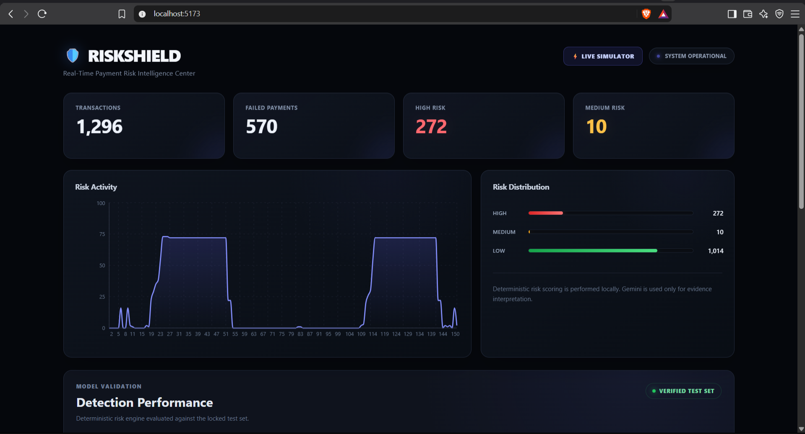
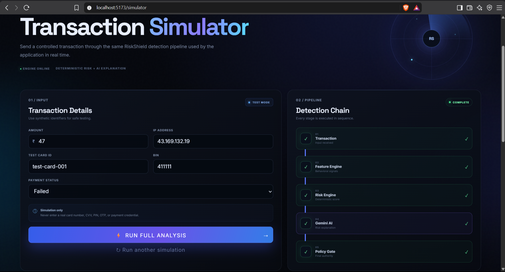

# RiskShield — AI Risk Manager for Card-Testing Fraud Detection

**Razorpay AI Buildathon 2026 — Track 2: AI Risk Manager**

> **100% precision, 0 false positives, on a locked test set that includes bank-outage and flash-sale transaction spikes.** RiskShield doesn't just detect card-testing attacks — it proves, with measured numbers, that it never confuses high volume with fraud.

RiskShield detects BIN attacks and card-testing fraud in real time, while proving — with measured precision and recall — that it does not block genuine customers just because transaction volume is high.



## The Problem

Fraudsters use bots to test large numbers of generated or stolen card numbers against a payment gateway ("card testing" / "BIN attacks"), usually from one source, using many different cards, tiny amounts, and a high decline rate. A naive fraud filter that just reacts to "lots of failed payments" will also misfire on two very common, completely legitimate situations:

- A **bank outage** causing many real customers' payments to fail around the same time
- A **flash sale** causing a genuine spike in transaction volume

RiskShield's core design goal was to catch real card-testing attacks while proving, with real numbers, that it does **not** confuse high volume with fraud.

## Architecture

```
Razorpay Webhook ──┐
                    ├──► Shared Pipeline ──► Dashboard
Live Simulator ─────┘

Shared Pipeline:
Transaction → Feature Extraction → Risk Engine → Gemini (explainer) → Policy Gate → Final Decision
```

**Feature Extraction** computes 7 behavioral signals using three separate views of recent activity:
- **Same-IP view**: velocity (attempts in 5/15 min), unique cards tried from one IP
- **Same-BIN view**: BIN velocity, unique IPs targeting the same BIN (catches *distributed* attacks spread across many IPs, not just one)
- **Overall view**: decline rate, small-amount ratio

**Risk Engine** combines two independent, fully deterministic components — no black-box model, no LLM in this step:
- **Rules** (70% weight): five named, explicit thresholds (e.g. `HIGH_VELOCITY_5MIN`, `DISTRIBUTED_BIN_ATTACK`) — auditable, so every flagged transaction can be traced to exactly why it fired
- **Statistical anomaly scoring** (30% weight): z-scores comparing current behavior against a baseline built from genuine transaction history

This produces a 0–100 risk score and a LOW / MEDIUM / HIGH classification.

**Gemini (AI Risk Manager)** receives the risk score and the underlying evidence and returns a structured JSON explanation and a recommended action. **Gemini never sees or decides the risk score itself** — it only interprets evidence the risk engine already computed.

**Policy Gate** has final authority, not the AI:
- Risk engine says HIGH → always blocks, regardless of what Gemini says
- Risk engine says LOW → always allows recovery, regardless of what Gemini says
- Gemini can never unilaterally cause a block — if it recommends `BLOCK_RECOVERY` but the score isn't HIGH, the decision is downgraded to `MONITOR`
- MEDIUM is the one zone where Gemini's nuanced read is trusted — but capped at `MONITOR`, never a full block

This isn't just a design principle on paper — it was verified live. During testing, a rapid sequence of card-testing-style transactions pushed Gemini to recommend `BLOCK_RECOVERY`, but the deterministic risk score hadn't yet crossed the HIGH threshold. **The policy gate overrode Gemini's recommendation in real time**, downgrading the action to `MONITOR` and logging exactly why:

> *"AI recommended blocking, but risk engine score did not reach HIGH — downgraded to MONITOR as a safety measure."*

This is the entire architecture's thesis proven live, in one API call: the AI explains, it does not decide.

## Evaluation Methodology

A synthetic dataset (~8,000 transactions) was generated with four labeled scenarios: genuine transactions, card-testing attacks, bank outages, and flash sales. The dataset was split using **stratified sampling per scenario** (not a naive time-based split) into development (70%), validation (15%), and a **locked test set** (15%) — ensuring every split contains a fair, representative share of each scenario, including rare edge cases.

Thresholds were tuned only against the development and validation sets. The locked test set was evaluated **exactly once**, after all tuning was finalized, and never touched again.

### Results (locked test set, 1,296 transactions, never used for tuning)

| Metric | Value |
|---|---|
| Precision | 100.0% |
| Recall | 90.1% |
| F1 Score | 0.948 |
| Accuracy | 97.7% |
| False Positives | 0 |

**Zero false positives** — including on every bank-outage and flash-sale transaction in the test set, despite both scenarios producing high transaction volume. This is the core claim the system was built to prove.

The remaining ~10% of missed attacks are concentrated in the first few transactions of each attack burst, before enough pattern history has accumulated to trigger detection — an honest, explainable limitation rather than a fixable bug: the very first attempt in any card-testing attack looks identical to a normal customer, by definition, since no pattern exists yet.

## Live Integration

Two live entry points feed the same detection pipeline:

1. **Razorpay webhook** (`/api/webhook/razorpay`) — receives real `payment.failed` events from Razorpay's test-mode environment via a webhook, maps Razorpay's payload into the system's transaction format, and runs it through the full pipeline.
2. **Live Transaction Simulator** — a dashboard page for manually submitting transactions and watching the risk score, Gemini's explanation, and the policy gate's decision update in real time, including live accumulation of behavioral history across repeated submissions.



Both paths call the identical `processLiveTransaction()` function — there is only one detection pipeline, not two.

## Dashboard

A React dashboard ("RiskShield") displays live transaction volume, risk distribution, a chart of risk scores over time, and a clickable incident view showing the full evidence trail — features, fired rules, Gemini's explanation, and the policy gate's final decision — for any transaction. A "Detection Performance" panel surfaces the live evaluation metrics above, computed directly from the locked test set.

## Tech Stack

- **Backend**: Node.js, Express
- **AI**: Google Gemini (`gemini-3.6-flash`) via `@google/generative-ai`
- **Frontend**: React (Vite), Recharts
- **Integration**: Razorpay Test Mode, webhooks, ngrok

No database is used — the system is stateless by design for this demo, with in-memory processing for live events. No Python or ML training libraries were used; detection is fully rule- and statistics-based, prioritizing explainability and auditability over marginal accuracy gains from a trained model.

## Running Locally

```bash
# Install dependencies
npm install
cd dashboard-frontend && npm install && cd ..

# Generate the synthetic dataset
node src/simulator/build-dataset.js

# Add your Gemini API key to a .env file
echo "GEMINI_API_KEY=your_key_here" > .env

# Start the backend
node src/dashboard-api/server.js

# In a separate terminal, start the frontend
cd dashboard-frontend && npm run dev
```

Visit `http://localhost:5173` for the dashboard.

## Project Structure

```
src/
  simulator/       — synthetic transaction & dataset generation
  features/        — behavioral feature extraction
  risk-engine/      — rules, anomaly scoring, policy gate, evaluation
  ai/               — Gemini explainer integration
  dashboard-api/    — Express server, webhook, live simulator endpoint
dashboard-frontend/ — React dashboard
data/               — generated datasets (gitignored)
```

## License

Built for the Razorpay AI Buildathon 2026. Open for review and reference.